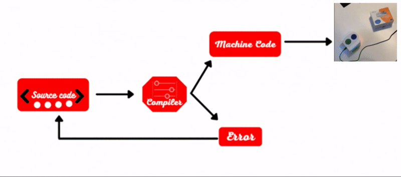

# Python Compiler for the Thymio Robot

This compiler generates bytecode to be executed on the Thymio II robot. It takes in python source code (`.py`), generates an AST (Abstract Syntax Tree), creates intermediate code, and outputs the result to the terminal. 
[Run the code!](#running-the-code)  
or 
[Read the documentation!](documentation.pdf)

The source file ([compiler.py](source/compiler.py)) can largely be divided into five parts:

1. Constants and Construct definitions: 
    This defines several constants and dictionaries used by the Thymio. These include opcodes, and dictionaries for converting between Python operators and Thymio opcodes. It also includes dictionaries for Thymio-specific identifiers, variables, and native function calls. Additionally, they defines the class *HoleCall*, which is used to keep track of "holes" in the code where addresses are yet to be filled in, and scope_flag, which tracks the current scope of the code. Finally, the code sets several variables used to read and store Thymio code.
2. Byte-array manipulation functions: 
   This consists of several functions that are defined to manipulate the intermediate code list. Two functions, "int_to_bytes" and "bytes_to_int," convert integers to bytes and vice versa. The "emit_byte" and "emit_word" functions append a byte or word to the list. The "emit_word_at" function is used to insert words into specific locations in the list. The "hole" function adds a word of value 0 to the list and returns the index of the newly added word. The "reset_locals" and "fetch_var_offset" functions are used to manage variables and their offsets within the list.
3. Pre-processor: 
    This defines a function called "preprocessor" that takes the AST as input and an optional "mode" parameter. The function reorders the AST by moving any function definitions to the end of the tree. If "mode" is set to a non-zero value, the function generates bytecode for the beginning of the intermediate code. It also creates "holes" in the emitted bytecode to be filled in later. Additionally, the function sets up global and local variables for Thymio robot events.
4. Code generator: 
   This is a compilation of different conditions for code generation, and is called recursively from the head of the AST. The code_gen() function is the main function that is responsible for generating the intermediate code based on the current branch of the AST. The branch could be of various types such as ast.Assign, ast.Call, ast.FunctionDef, and so on. 
    Some of the actions  include calling other functions to generate code, adding bytes and words to the code list, and modifying various other global flags and variables.

5. Code printer: 
   This portion simply goes through the intermediate code iteratively and prints it out to the terminal. It includes a debug mode that keeps track of the byte-array output size for each opcode produced. In a many of speaking, these are like the "line numbers" of the byte-code program memory.

Overall, the Thymio compiler is an essential tool for developing software for the Thymio robot, allowing programmers to write high-level python code and then translate it into low-level code.

## Running the code
After downloading the repo, go into the [source](/source/) folder, and put your code into the [test_file.py](source/test_file.py) file. There are already many commented examples demonstrating acceptable python code. Then, simply run the [compiler.py](source/compiler.py) script, and it outputs the bytecode into the terminal. 
For full details about the compilers abilities, please read the [documentation](documentation.pdf)